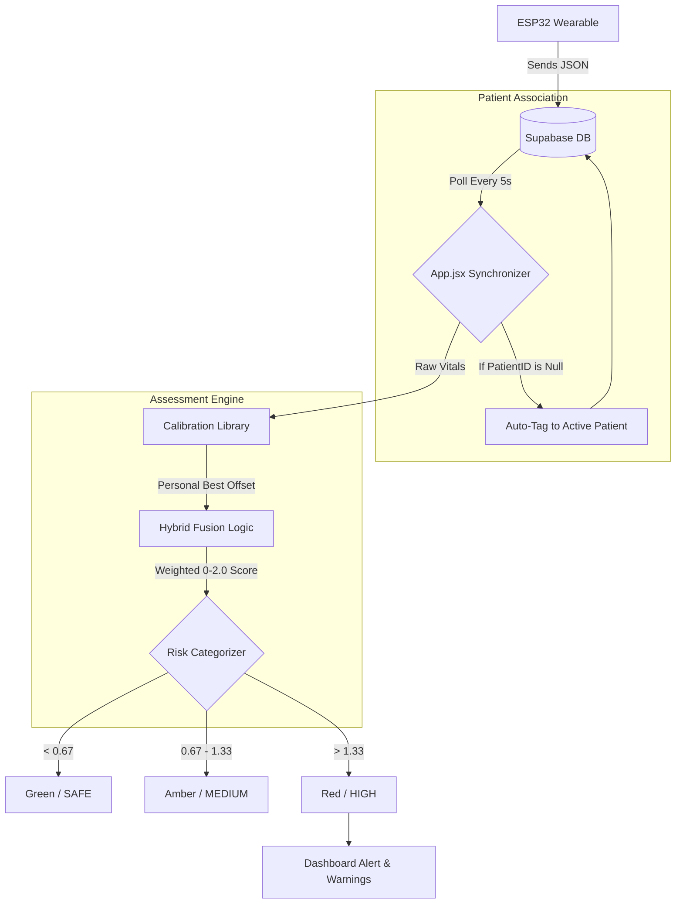

# 🛡️ HIKON 2.1.1: System Architecture & Workflow

This document outlines the end-to-end data flow and clinical assessment logic for the Hikon 2.1.1 Clinical Dashboard.

---

## 1. Data Ingestion (IoT Layer)
*   **Signal Capture**: The ESP32 device captures raw data from the MAX30105 (Oxygen/Heart Rate) and the Accelerometer (Motion/Breathing).
*   **Cloud Upload**: The device pushes a JSON payload to the Supabase `s3_sensor_data` table via the REST API.
*   **Device Tagging**: Records are uploaded with a `device_id` (e.g., 'DEMO-01') but usually have a **Null Patient ID** initially.

## 2. Auto-Association Logic (The "Sync")
*   **Retrieval Fetch**: The Dashboard (Clinical App) polls Supabase every 5 seconds. It looks for records that either match the **current Patient's ID** OR are **Null** (Untagged).
*   **Auto-Claiming**: If the App finds an untagged record from the patient's device, it automatically "claims" it by updating the `patient_id` in the database to match the active dashboard patient.

## 3. Clinical Processing Engine (Calibration)
*   **SpO2 Baseline Check**: The system compares the raw SpO2 against the child’s recorded **"Personal Best" (PB)**. If the reading is at or above the PB, it is forced to "Safe" to prevent false alarms.
*   **Breathing Rate Fallback**: If the hardware `br_rate` is missing, the App pulls accelerometer data and uses the **Zero-Crossing Algorithm** to estimate the breathing rate based on chest-wall movement.

## 4. Hybrid Fusion & Risk Assessment
*   **Symptom Burst Analysis**: The system analyzes the last **60 seconds** of data to count "bursts" of coughs or wheezes.
*   **Triple-Categorization**: Each metric (Oxygen, Breathing, Symptoms) is assigned a risk level: `0 (Safe)`, `1 (Medium)`, or `2 (High)`.
*   **Weighted Average**: The system applies clinical weights:
    *   `Risk Score = (OxygenRisk * 2.5 + BreathingRisk * 1.5 + SymptomRisk * 1.0) / 5.0`
*   **The Critical Override**: If SpO2 falls to **≤ 95%**, the weighted score is bypassed, and the system immediately issues a **HIGH/RED** alert.

## 5. Frontend Visualization
*   **Rendering**: The `sensors` state in React updates.
*   **Dynamic Theming**: The UI colors shift (Green → Amber → Red) and "Potential Warnings" are generated based on which specific metric triggered the risk.

---

## 6. Logic Flow Diagram (Mermaid)

